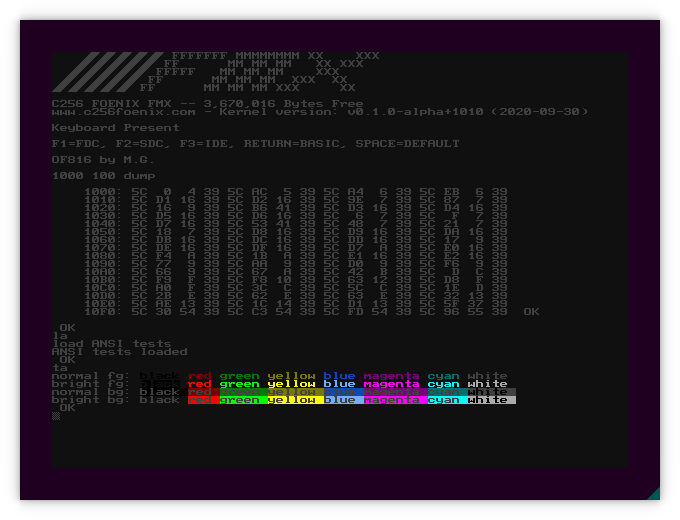
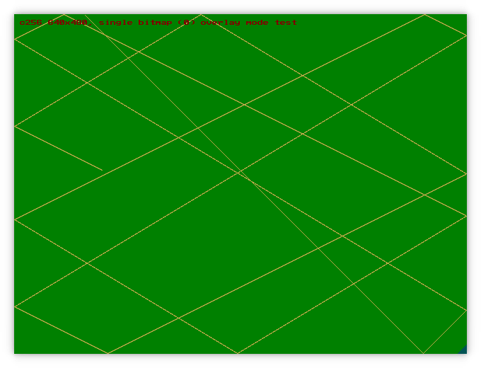
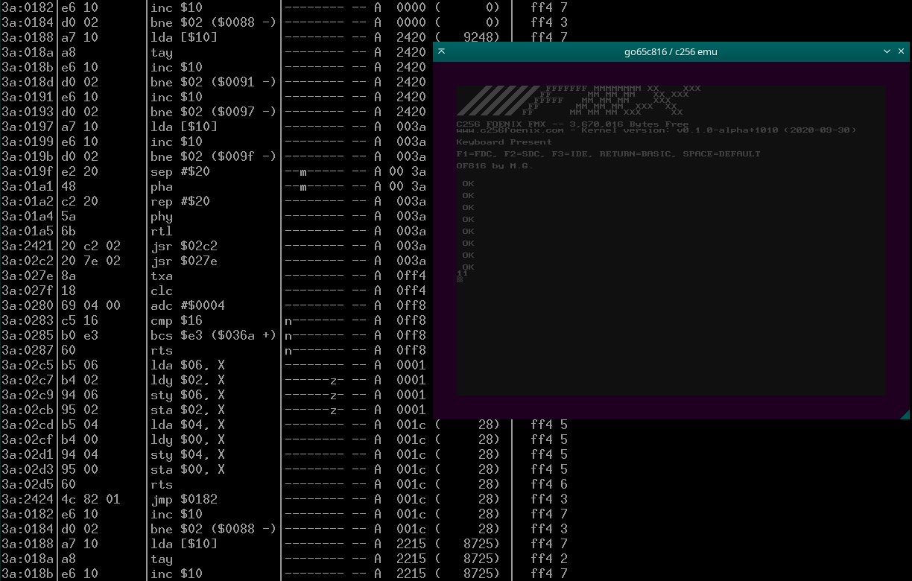

# go65c816
64c816 / [c256](https://c256foenix.com/) emulator written in Go

## Preface

* That project was created for my personal needs and lacks more of features.
  If You are interested in official, full-blown C256 Foenix emulator, You
  should take a look at [Foenix IDE](https://github.com/Trinity-11/FoenixIDE)

  FoenixIDE is a .NET application but can run on Linux thanks to Wine.

* At this moment text-based interface doesn't work. If You need it, there
  is a [separate branch](https://github.com/aniou/go65c816/tree/tui)

* There is a problem with BASIC embedded into official C256 kernel - it
  does not work properly on emulator. The case is under investigation.

## Some screenshots

[of816 port](https://github.com/aniou/of816/tree/C256/platforms/C256)


Simple overlay test


Simple disassembler


## Supported systems

Program was tested on:

* Ubuntu 20.04 / Go 1.13
 
Word of warning: my SDL code is rather naive, so there is a possibility that
it would not work on Your system (bizarre colors or something). It may be
corrected in future.

## Emulation state

Current emulation state is rather sparse - C256 has 
[plenty of features](https://wiki.c256foenix.com/index.php?title=Main_Page),
and at this moment I was able to implement only small subset of them. For
full-fledged emulator see [Foenix IDE](https://github.com/Trinity-11/FoenixIDE).

### Vicky II

See [here](https://wiki.c256foenix.com/index.php?title=VICKY_II) for VICKY II spec

- [x] 640x480 mode
- [ ] 800x600 mode
- [ ] double pixel mode
- [x] fullscreen mode
- [x] border support
- [x] text mode (partial, no scroll)
- [x] text LUT
- [x] cursor (but no second font bank)
- [x] fonts
- [x] bm0 bitmap
- [x] bm1 bitmap
- [x] bitmap LUT
- [x] overlay and background support
- [ ] tiles
- [ ] sprites
- [ ] GAMMA LUT

### GABE

See [here](https://wiki.c256foenix.com/index.php?title=GABE) for GABE spec

- [x] keyboard input (GABE)
- [ ] mouse
- [ ] all other

### general features

- [x] IRQ (partial: only 65c816 mode)
- [ ] NMI
- [ ] reset button

## Installing

```bash
git clone https://github.com/aniou/go65c816
cd go65c816/cmd/gui
go build -o gui *go
```

## Running

```bash
cd go65c816/cmd/gui
./gui of816.ini 
./gui bm0.ini
```

## ini files

`*.ini` files specifies code (only Intel hex format at this moment) and 
initial state of PC (to be strick K and PC registers of 65c816). There
may be multiple files loaded, specified by `file1` to `file999` keys.

Memory isn't cleared between before load, so there is a possibility to
patch or combine programs, like in following example.

At this moment only `file` and `start` keys are supported.

```ini
[load]
file1=../../data/kernel.hex
file2=../../data/graph5bm0.hex

[cpu]
start = $03:0000
```

## Keybindings

There are few keybindings now. 
*Warning:* following keys aren't passed to emulator!

|Key     |Effect
---------|---------------------------
F9       |Toggole disassembler output
F10      |- (nothing)
F11      |Toggle full-screen
F12      |Exit emulator

## Memory map

Machine parameters may be tweaked by editing `emulator/platform/platform.go` file. Every memory area should be attached to internal bus, like in following example:

```go
        bus, _           := bus.New()
        platform.CPU, _   = cpu65c816.New(bus)
        ram, _           := memory.New(0x400000, 0x000000)
        platform.GPU, _   = vicky.New()
        platform.GABE, _  = gabe.New()

        platform.CPU.Bus.Attach(ram,            "ram", 0x000000, 0x3FFFFF)
        platform.CPU.Bus.Attach(platform.GPU, "vicky", 0xAF0000, 0xEFFFFF)
        platform.CPU.Bus.Attach(platform.GABE, "gabe", 0xAF1000, 0xAF13FF)

        platform.CPU.Bus.EaWrite(0xFFFC, 0x00)  // boot vector
        platform.CPU.Bus.EaWrite(0xFFFD, 0x10)
        platform.CPU.Reset()

```

 * minimal area size: **16 bytes**
 * areas **must be** aligned at 4 bits (16 bytes)
 * areas are stacked, i.e. later shadows previous 

## Foreword

Project was inspired by [NES emulator](https://github.com/fogleman/nes) created by Michael Fogleman and [MOS 6502 emulator](https://github.com/pda/go6502) by Paul Annesley and contains files or concepts from both projects. Some algorithms and behaviours are modeled on the [C++ 65c816 emulator](https://github.com/andrew-jacobs/emu816) by Andrew Jacobs.

Project draws inspiration and code snippets from [Foenix IDE](https://github.com/Trinity-11/FoenixIDE)

